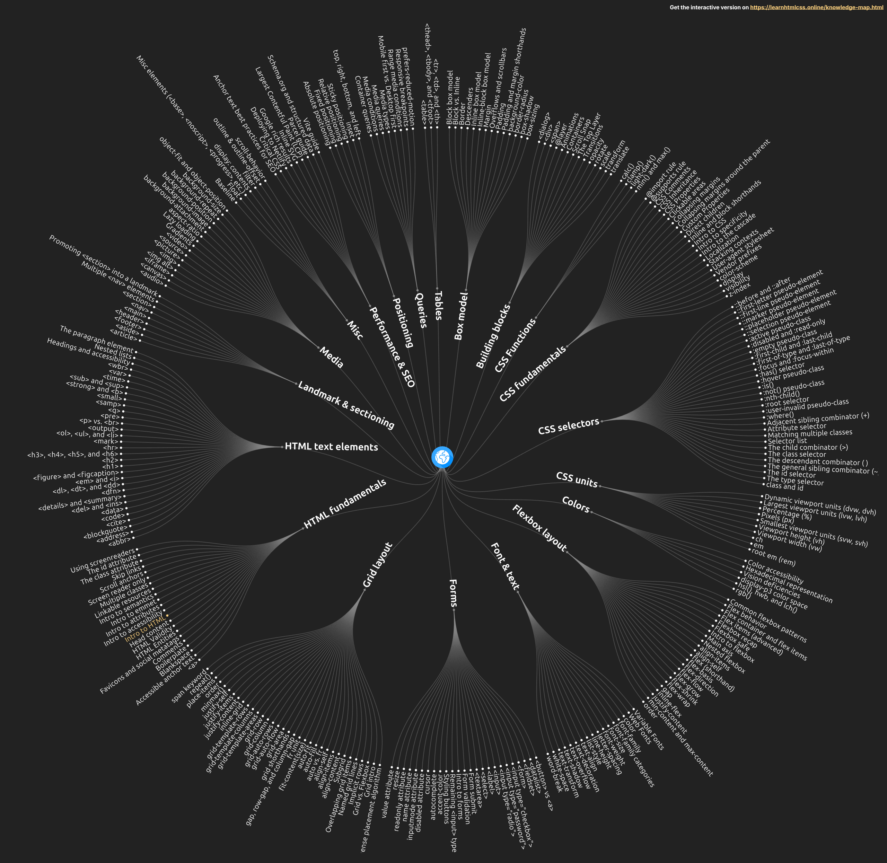

# Mastering Modern CSS: A Frontend Mentor Journey Through the Knowledge Map

*Building robust, accessible components with CUBE CSS and Every Layout patterns*

---

## Welcome to the Journey: Systematic Skill Development

Frontend development has evolved dramatically in recent years. Gone are the days when we could simply learn HTML, CSS, and JavaScript in isolation. Today's web demands systematic thinking, architectural awareness, and a deep understanding of how modern CSS methodologies can create maintainable, accessible, and truly responsive components.

This post kicks off a **Frontend Mentor Knowledge Map Series** – a systematic approach to skill development where each challenge becomes an opportunity to apply and demonstrate specific concepts from the comprehensive web development knowledge map. Rather than just "completing challenges," we're using each project as a focused learning laboratory.

### Why This Approach Matters

Most developers approach learning haphazardly: complete a tutorial here, build a project there, maybe pick up a new framework. But **systematic skill development** means:

- **Intentional Practice**: Each project targets specific skills and concepts
- **Progressive Complexity**: Building foundational knowledge before advanced techniques  
- **Documentation**: Creating resources that benefit the entire developer community
- **Real-World Application**: Connecting theory to practical implementation

## The Challenge: More Than Meets the Eye

The [Blog Preview Card challenge](https://www.frontendmentor.io/challenges/blog-preview-card-ckPaj01IcS) appears deceptively simple – create a card component with an image, badge, title, description, and author section. But simplicity often provides the perfect canvas for applying sophisticated techniques.

Instead of reaching for a framework or writing quick-and-dirty CSS, this project became an exploration into **modern CSS architecture**:

- **CUBE CSS methodology** for maintainable component structure
- **Every Layout patterns** for intrinsic responsiveness  
- **Design tokens** for systematic theming
- **Accessibility-first** development approach
- **Zero media queries** through intrinsic web design

The goal wasn't just to complete the challenge, but to create a **reference implementation** that demonstrates how modern CSS methodologies work in practice.

## Knowledge Map Analysis: What We Covered

The web development knowledge map contains hundreds of interconnected concepts. This single project allowed us to meaningfully apply concepts across six major domains:



### 🏗️ **HTML Foundations** (Core Competency)
**Applied Concepts:**
- Semantic element selection (`<article>`, `<header>`, `<footer>`, `<time>`)
- Document outline and heading hierarchy
- ARIA relationships with `aria-labelledby`
- Progressive enhancement principles

**Real-World Impact:** The HTML structure works perfectly with screen readers, provides excellent SEO foundation, and maintains functionality even without CSS loaded.

### 🎨 **CSS Architecture** (Intermediate to Advanced)
**Applied Concepts:**
- CUBE CSS methodology (Composition → Utility → Block → Exception)
- Modern CSS features (custom properties, logical properties, modern functions)
- Specificity management with `:where()` selector
- Design token systems with semantic naming

**Real-World Impact:** The CSS is highly maintainable, easily themeable, and follows patterns that scale to large applications.

### 📐 **Layout Systems** (Advanced)
**Applied Concepts:**
- Every Layout patterns (Stack, Center, Cluster, Box)
- Intrinsic web design principles
- Container-based responsive design
- Algorithmic thinking for layout problems

**Real-World Impact:** The component works at any size without media queries, making it truly reusable across different contexts.

### ♿ **Accessibility** (Intermediate)
**Applied Concepts:**
- Semantic HTML as accessibility foundation
- Focus management and keyboard navigation
- Color contrast compliance (WCAG AA)
- Reduced motion preferences

**Real-World Impact:** The component is fully accessible to users with disabilities, improving usability for everyone.

### ⚡ **Performance** (Intermediate)
**Applied Concepts:**
- Efficient CSS selectors and specificity
- Font loading optimization with `font-display: swap`
- Transform-based animations for smooth performance
- Minimal CSS approach (156 lines total)

**Real-World Impact:** Fast loading and smooth interactions across all devices and connection speeds.

### 🔄 **Responsive Design** (Advanced)
**Applied Concepts:**
- Intrinsic responsiveness without media queries
- Fluid typography with `clamp()` functions
- Content-first design approach
- Container-based thinking

**Real-World Impact:** Components that adapt naturally to any screen size, reducing complexity and improving maintainability.

## Deep Dive: CUBE CSS in Action

### Understanding the Methodology

**CUBE CSS** stands for **Composition → Utility → Block → Exception** – a methodology that works *with* the CSS cascade rather than against it. Here's how each layer works in practice:

#### 1. Composition: Layout Patterns

```css
/* The Stack - automatic vertical spacing */
.flow > * + * {
  margin-top: var(--flow-space, 1em);
}

/* The Center - intrinsic centering */
.center {
  box-sizing: content-box;
  margin-inline: auto;
  max-inline-size: var(--measure, 60ch);
}

/* The Cluster - flexible horizontal layouts */
.cluster {
  display: flex;
  flex-wrap: wrap;
  gap: var(--cluster-space, var(--space-s));
  align-items: center;
}
```

**Why This Works:** Composition patterns solve layout problems algorithmically. The Stack pattern eliminates margin collapse issues, Center pattern works at any viewport size, and Cluster pattern handles flexible layouts with consistent spacing.

#### 2. Utility: Single-Purpose Classes

```css
.bg-primary { background-color: var(--color-primary); }
.color-dark { color: var(--color-gray-950); }
.text-large { font-size: var(--text-size-large); }
```

**Key Insight:** Unlike atomic CSS approaches that fight the cascade, CUBE utilities complement it. They're used sparingly for properties that truly benefit from single-purpose classes.

#### 3. Block: Component-Specific Styles

```css
.blog-card {
  background-color: var(--color-white);
  box-shadow: var(--shadow-card);
  transition: transform var(--transition-base);
  max-width: 24rem;
}
```

**Architecture Benefit:** Block styles define the component's core appearance while leveraging composition patterns and design tokens. They focus on what makes this component unique.

#### 4. Exception: State Modifications

```css
.blog-card:where(:hover, :focus-within) {
  transform: translateY(-2px);
  box-shadow: 12px 12px 0px 0px var(--color-gray-950);
}
```

**Modern CSS Power:** The `:where()` selector provides zero specificity, making overrides predictable. State changes are explicit and respect user preferences.

### Class Naming Strategy

```html
<article class="[ blog-card ] [ box ] [ flow ]" aria-labelledby="article-title">
  <div class="[ blog-card__content ] [ flow ]">
    <div class="[ blog-card__meta ] [ cluster ]">
      <span class="[ badge ] [ bg-primary color-dark ]">Learning</span>
    </div>
  </div>
</article>
```

**Square Bracket Grouping:** `[ Block ] [ Composition ] [ Utility ]`

This makes the CSS architecture immediately visible in the HTML, helping developers understand how styles are organized and making maintenance easier.

## Deep Dive: Every Layout Patterns

### The Philosophy Shift

Traditional responsive design asks: "How does this look at 768px? At 1024px?" 

Every Layout asks: "How does this content want to behave naturally?"

This philosophical shift leads to **intrinsic web design** – components that adapt to their content and container rather than arbitrary viewport sizes.

### Pattern Implementation

#### The Stack Pattern
```css
.flow > * + * {
  margin-top: var(--flow-space, 1em);
}
```

**Problem Solved:** Vertical spacing that's consistent, configurable, and doesn't suffer from margin collapse issues.

**Applied To:** 
- Main card content (`.blog-card`)
- Content sections (`.blog-card__content`)

**Configuration:**
```css
.blog-card { --flow-space: var(--space-s); }
.blog-card__content { --flow-space: var(--space-xs); }
```

#### The Center Pattern
```css
.center {
  margin-inline: auto;
  max-inline-size: var(--measure, 60ch);
  padding-inline-start: var(--gutter, var(--space-s));
}
```

**Problem Solved:** Content centering that works at any viewport size with intrinsic side gutters.

**Applied To:** Page layout centering the card on screen

#### The Cluster Pattern
```css
.cluster {
  display: flex;
  flex-wrap: wrap;
  gap: var(--cluster-space, var(--space-s));
  align-items: center;
}
```

**Problem Solved:** Horizontal layouts with consistent spacing that wrap naturally.

**Applied To:** 
- Badge area (flexible for multiple badges)
- Author section (avatar + name)

### Why Zero Media Queries Works

```css
/* Traditional approach */
@media (min-width: 768px) {
  .card { width: 50%; }
}
@media (min-width: 1024px) {
  .card { width: 33.333%; }
}

/* Intrinsic approach */
.card {
  width: min(100% - var(--space-m), 24rem);
}
```

**Benefits:**
- **Context Independence:** Components work in any container
- **Reduced Complexity:** No breakpoint management
- **Future Proof:** New device sizes work automatically
- **Content First:** Layout adapts to content, not arbitrary screen sizes

## Deep Dive: Design Tokens and Systematic Theming

### Token Architecture

```css
:root {
  /* Primitive tokens - the raw values */
  --yellow-400: hsl(47, 88%, 63%);
  --neutral-0: hsl(0, 0%, 100%);
  --neutral-500: hsl(0, 0%, 42%);
  --neutral-950: hsl(0, 0%, 7%);
  
  /* Semantic tokens - meaning and purpose */
  --color-primary: var(--yellow-400);
  --color-surface: var(--neutral-0);
  --color-text-primary: var(--neutral-950);
  --color-text-secondary: var(--neutral-500);
  
  /* Component tokens - specific usage */
  --color-badge-bg: var(--color-primary);
  --color-badge-text: var(--color-text-primary);
  --color-card-bg: var(--color-surface);
}
```

**Three-Tier System:**
1. **Primitive tokens:** Raw design values
2. **Semantic tokens:** Meaning-based aliases  
3. **Component tokens:** Specific usage contexts

**Theming Power:** Change a primitive token and all related components update automatically.

### Spacing Scale Implementation

```css
:root {
  /* T-shirt sizing with mathematical progression */
  --space-3xs: 0.25rem;  /* 4px */
  --space-2xs: 0.5rem;   /* 8px */
  --space-xs: 0.75rem;   /* 12px */
  --space-s: 1rem;       /* 16px */
  --space-m: 1.5rem;     /* 24px */
  --space-l: 2rem;       /* 32px */
  --space-xl: 3rem;      /* 48px */
  
  /* Contextual spacing tokens */
  --space-card-padding: var(--space-m);
  --space-content-gap: var(--space-s);
  --space-meta-gap: var(--space-xs);
}
```

**Mathematical Consistency:** The 1.5x progression creates visual harmony while remaining human-readable.

## Real-World Applications: Beyond the Challenge

### Scaling to Component Libraries

This blog card demonstrates patterns that scale beautifully to larger systems:

```css
/* Base card pattern */
.card {
  background-color: var(--color-surface);
  box-shadow: var(--shadow-card);
  border-radius: var(--radius-l);
}

/* Variant implementations */
.card--product { /* Product-specific styling */ }
.card--profile { /* Profile-specific styling */ }
.card--notification { /* Notification-specific styling */ }

/* All cards inherit the composition patterns */
.card.flow { /* Stack pattern applied */ }
.card.box { /* Box pattern applied */ }
```

### Design System Integration

The token system makes design system integration seamless:

```css
/* Design system theme */
:root {
  --brand-primary: hsl(210, 100%, 50%);
  --brand-surface: hsl(210, 20%, 98%);
}

/* Component automatically inherits new theme */
.blog-card {
  background-color: var(--color-surface); /* Uses --brand-surface */
}

.badge {
  background-color: var(--color-primary); /* Uses --brand-primary */
}
```

### Framework Integration

CUBE CSS works excellently with modern frameworks:

```jsx
// React component with CUBE CSS classes
function BlogCard({ title, description, author, badge }) {
  return (
    <article className="[ blog-card ] [ box ] [ flow ]">
      <div className="[ blog-card__content ] [ flow ]">
        <div className="[ blog-card__meta ] [ cluster ]">
          <span className="[ badge ] [ bg-primary color-dark ]">
            {badge}
          </span>
        </div>
        <h2 className="[ blog-card__title ]">{title}</h2>
        <p className="[ blog-card__description ]">{description}</p>
      </div>
    </article>
  );
}
```

## Key Learnings & Practical Insights

### What Worked Exceptionally Well

**1. CUBE CSS + Every Layout Synergy**
The combination proved more powerful than either methodology alone. CUBE provides the architectural structure while Every Layout provides the algorithmic layout solutions.

**2. Design Tokens for Everything**
Using custom properties for colors, spacing, shadows, and transitions made theming trivial and debugging easier. The token hierarchy created a single source of truth.

**3. Intrinsic Responsiveness**
Zero media queries didn't feel like a constraint – it felt liberating. Components that work anywhere reduce cognitive load and testing burden.

**4. Accessibility by Default**
Starting with semantic HTML and building accessibility features from the ground up resulted in a better experience for everyone, not just users with disabilities.

### Challenges and Solutions

**Challenge:** Debugging without familiar media queries.
**Solution:** Browser dev tools' responsive mode becomes even more valuable for testing continuous responsiveness.

**Challenge:** Learning curve for intrinsic design thinking.
**Solution:** Start with simple functions like `clamp()` and `min()` before moving to complex space toggles.

**Challenge:** Debugging without familiar media queries.
**Solution:** Browser dev tools' responsive mode becomes even more valuable for testing continuous responsiveness.

### Performance Insights

**CSS Efficiency:**
- **156 total lines** for complete component
- **Low specificity** selectors for predictable overrides
- **Transform-based** animations for smooth performance
- **Custom properties** reduce duplication and enable runtime theming

**Loading Performance:**
- **Font preloading** with appropriate display strategies
- **Image optimization** with proper dimensions
- **Critical CSS** inlined for above-the-fold content

### Accessibility Achievements

**Beyond WCAG Compliance:**
- **Semantic HTML** provides excellent screen reader experience
- **Focus management** works naturally with keyboard navigation
- **Color independence** ensures information isn't conveyed through color alone
- **Reduced motion** respect improves experience for vestibular disorder users

## What's Next: Building the Series

This blog preview card is just the beginning. The **Frontend Mentor Knowledge Map Series** will systematically explore:

### Upcoming Challenges & Focus Areas

**Challenge 2: Social Links Profile**
- **Focus:** CSS layout fundamentals, hover states, accessibility
- **Knowledge Map Areas:** Flexbox layouts, interactive states, semantic HTML

**Challenge 3: Recipe Page**  
- **Focus:** Typography hierarchy, content structure, responsive design
- **Knowledge Map Areas:** Semantic content markup, CSS typography, accessibility

**Challenge 4: Registration Form**
- **Focus:** Form design, validation patterns, user experience
- **Knowledge Map Areas:** Form accessibility, validation, responsive forms

**Challenge 5: Contact Form**
- **Focus:** Advanced form handling, JavaScript validation, accessibility
- **Knowledge Map Areas:** Form validation, error handling, progressive enhancement

### Series Benefits for Developers

**Systematic Skill Building:** Each challenge builds on previous learnings while introducing new concepts.

**Real-World Preparation:** Challenges mirror common development tasks you'll encounter in professional work.

**Community Learning:** Detailed documentation benefits the entire Frontend Mentor community.

**Portfolio Development:** High-quality implementations demonstrate sophisticated technical skills to potential employers.

## Community Engagement: Let's Learn Together

### Discussion Questions

**For Beginners:**
- Which Every Layout pattern would you find most useful in your current projects?
- How does the CUBE CSS approach compare to methodologies you've used before?
- What aspects of intrinsic responsive design feel most challenging to implement?

**For Intermediate Developers:**
- How would you adapt this token system for a multi-brand design system?
- What additional accessibility features would enhance this component?
- How would you test intrinsic responsiveness without traditional breakpoints?

**For Advanced Developers:**
- How would you integrate this approach with CSS-in-JS solutions?
- What optimizations would you add for large-scale component libraries?
- How would you extend the CUBE methodology for complex application states?

### Resource Recommendations

**Essential Reading:**
- [CUBE CSS Documentation](https://cube.fyi/) - Comprehensive methodology guide
- [Every Layout](https://every-layout.dev/) - Algorithmic layout solutions
- [Modern CSS Reset](https://piccalil.li/blog/a-modern-css-reset/) - Foundation for modern CSS

**Tools & Utilities:**
- [Clamp() Calculator](https://clamp.font-size.app/) - Fluid typography calculations
- [Color Contrast Checker](https://webaim.org/resources/contrastchecker/) - WCAG compliance validation
- [Can I Use](https://caniuse.com/) - Modern CSS feature support

**Community Resources:**
- [Frontend Mentor](https://www.frontendmentor.io/) - Practice challenges with professional designs
- [CSS Working Group](https://github.com/w3c/csswg-drafts) - Future CSS specifications
- [Web.dev](https://web.dev/) - Modern web development best practices

## Conclusion: The Journey Continues

This blog preview card represents more than a completed Frontend Mentor challenge – it demonstrates how **systematic skill development** can transform simple projects into comprehensive learning experiences.

By applying modern CSS methodologies like CUBE CSS and Every Layout, we created a component that's not just visually appealing, but **architecturally sound, fully accessible, and intrinsically responsive**. The zero-media-query approach proves that modern CSS can handle responsive design more elegantly than traditional breakpoint-based methods.

The **knowledge map approach** ensures we're not just building projects randomly, but **systematically covering the essential skills** modern web developers need. Each challenge becomes an opportunity to deepen understanding while creating resources that benefit the entire developer community.

**What makes this approach powerful:**
- **Intentional skill targeting** based on comprehensive knowledge mapping
- **Real-world applicability** beyond simple challenge completion
- **Community benefit** through detailed documentation and analysis
- **Progressive complexity** building sophisticated skills over time

The next challenge in our series will explore JavaScript fundamentals through an interactive component, continuing our systematic journey through the web development knowledge map.

Until then, try implementing these patterns in your own projects. Start with the Stack pattern for vertical spacing – you'll be amazed how much cleaner your CSS becomes when you stop fighting margin collapse.

**Ready to join the systematic learning journey? The web development knowledge map is vast, but with intentional practice and community learning, we'll master it together, one Frontend Mentor challenge at a time.**

---

*Found this helpful? Follow along as we systematically work through the Frontend Mentor knowledge map, building sophisticated skills while creating resources that benefit the entire developer community. Next up: Interactive Rating Component and JavaScript fundamentals.*

**Tags:** #CSS #WebDevelopment #FrontendMentor #CUBECSS #EveryLayout #ResponsiveDesign #Accessibility #ModernWeb #DesignSystems #KnowledgeMap